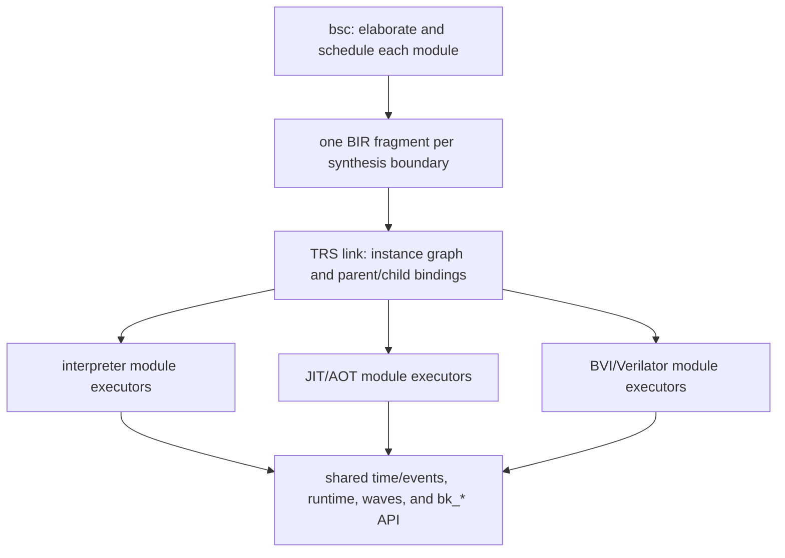

# TRS: a Rust/LLVM simulation backend for BSC

Status: normative architecture and migration plan.  The document began as
the "Bluesim 3" proposal (since renamed to "TRS"); historical source
references are retained where they explain the semantic contract, while §0
and the revised phasing govern the current hierarchy-first implementation.

## 0. Binding architecture rules

This section is normative.  It is an architecture reset after the first TRS
implementation demonstrated semantic coverage but allowed whole-design
planning and code generation to become the default.  When this section
conflicts with later historical prose, [BIR.md](BIR.md), a handoff document,
or the current implementation, this section wins until the other material is
updated.

1. **Correctness is non-negotiable.**  TRS must preserve BSC's scheduled TRS
   semantics and the observable Bluesim contract.  A scale or throughput win
   never excuses a semantic difference.
2. **Hierarchy is the canonical representation and execution model.**  A
   synthesized module is the unit of export, verification, interpretation,
   compilation, and reuse.  A design is an instance graph that binds those
   module artifacts.  **There is no global execution schedule.**  Neither
   export, link, code generation, nor runtime may construct a whole-design
   rule graph/order, a compressed `(instance, segment)` order, or an
   equivalent cross-hierarchy execution plan.  Renaming it a composition,
   boundary plan, dispatch table, or transient worklist does not exempt it.
3. **Scaling is an acceptance criterion, not a later optimization.**  For N
   identical instances, module-local analysis, interpreter preparation, LLVM
   lowering, optimization, and machine-code emission happen once per unique
   module specialization, not N times.  Binding and orchestration metadata
   may grow with instances and their boundary surface; it must not grow
   with instances times module-internal rule or def count.  This does not
   eliminate the per-instance state or runtime work needed to execute N
   physical instances; it forbids duplicating their executable plans.
4. **The interpreter is the executable base.**  It is the first complete
   implementation of every semantic feature, runs the same hierarchical
   module artifacts as compiled engines, and remains a production-capable
   per-module or per-segment fallback.  JIT and AOT replace module executors;
   they do not replace the architecture.
5. **Scheduling belongs to modules, including dynamic scheduling.**  BSC
   records module-local scheduling decisions and the guarded legal
   alternatives that require run-time selection.  Each module's scheduler
   coordinates its own work and its immediate children's declared boundary
   interactions, recursively.  TRS evaluates alternative guards against
   pre-edge state and obeys the exported contracts; it does not rerun BSC's
   conflict/SAT reasoning.  Independent choices stay local to their instances,
   never a Cartesian product of whole-design alternative schedules.
6. **`import "BVI"` is a first-class boundary implementation.**  A BVI module
   participates through the same scheduling, clock, reset, method, and path
   contract as a synthesized BSV module, while its body is opaque and may be
   executed by a Verilator-backed module executor.  Verilation is a build
   step; running an artifact is load-only.  BDPI remains the foreign-function
   boundary, distinct from BVI module execution.
7. **Optimizations come after the hierarchical baseline passes.**  Inlining,
   bounded boundary fusion, and layout coalescing are optional transforms
   over the canonical hierarchy.  Crossing a synthesis boundary
   requires measured benefit, an explicit profitability rule, a bounded
   cache/invalidation cost, and a retained generic hierarchical path.  An
   optimizer may specialize a bounded region; it may not make the specialized
   form the only executable form or reconstruct a global schedule.  The
   no-global-schedule rule also applies with optimization flags enabled.
8. **Architecture exceptions are explicit.**  A change that violates one of
   these rules must identify the violated rule, publish the scale and runtime
   measurements that justify it, state the new bound, and receive design
   review before landing.  An optimization flag is not an exception approval.
   Passing the semantic corpus alone is insufficient.

The permanent scale gates are:

- repeated-instance ladders report constant module-local work per unique
  specialization and bounded growth of binding/orchestration metadata;
- a leaf body edit leaves generic parent module artifacts unchanged when the
  boundary contract is unchanged;
- every interpreter, JIT, and AOT execution path, including optimized paths,
  constructs no global rule or segment schedule, even transiently; baseline
  compilation also contains no whole-design LLVM module or instance-expanded
  copy of module-local executable IR;
- mixed interpreted/compiled/BVI designs pass the same semantic and ordering
  tests as single-engine designs; and
- diagnostics expose unique modules, instances, module-local segments,
  declared boundary interactions, per-instance dynamic choices, per-module
  lowering count, emitted code bytes, and every cross-boundary specialization.

### 0.1 Hierarchical feasibility gate

Before production migration begins, P0 must demonstrate that the proposed
boundary model can express the complete TRS semantic surface.  Verilog is
evidence that hierarchical hardware descriptions can execute, but it is not
this proof: elaboration, static event scheduling, and simulator-specific
flattening do not demonstrate a reusable interpreter/compiler ABI, guarded
dynamic scheduling, mixed executors, or the required scale bounds.

For this gate, **fully hierarchical** has a precise meaning:

- every separately synthesized BSV module and every BVI module is an opaque
  executable boundary; non-synthesized source structure may be elaborated
  inside its owning artifact;
- a parent artifact may depend on a child's versioned interface and schedule
  contract, but may not inspect, embed, or copy the child's rules, defs,
  schedule nodes, state layout, or executable IR;
- each module schedules only its own rules and immediate-child boundary
  interactions; children own their internal scheduling, recursively at every
  depth, rather than exporting all descendant segments to an ancestor;
- the shared kernel may hold the instance registry, time/event queue,
  clock/reset routing, and observation buffers, but no design-wide ordering
  graph or traversal of rules, segments, or descendant boundary operations;
- module execution may suspend and resume at declared boundary interactions,
  but no module or kernel may first assemble the suspended work into a
  whole-design order, either statically or anew on each edge; and
- boundary events must describe genuine interface obligations.  Exposing
  every internal rule/segment as a nominal interface event, or wrapping the
  entire design in a new top-level scheduler, does not preserve hierarchy.

A global **time/event queue** is allowed; a global **within-edge execution
schedule** is not.  The queue delivers time, clock, reset, and external
events to opaque module endpoints.  It is not a place to enqueue a flattened
sequence of every descendant's rule or segment execution.  Module-local
worklists and a generic call stack/trampoline are allowed.  A diagnostic
execution trace may record the order that occurred, but may not become an
input plan for execution.  The boundary protocol's sufficiency is what P0
must establish, not an assumption made by this document.

The open question is not whether hierarchical state and code can execute:
Bluesim already provides those.  It is whether a reusable local protocol can
replace the global scheduling closure for every required semantic interaction
while meeting the representation/preparation bounds.  Hierarchical does not
mean calling each module once per cycle or completing a child atomically;
multiple boundary interactions and local suspension/resumption are allowed.
P0 must construct and justify that protocol, or produce a minimized
counterexample identifying the missing contract information.  Coordination
scaling is part of this gate; throughput tuning comes later and is not a
semantic feasibility assumption.

P0 builds a deliberately unoptimized hierarchical interpreter spike using
the proposed module-executor ABI.  It must include a minimized executable
witness for every distinct cross-boundary semantic interaction, not merely a
representative application.  The initial proof matrix is:

| Semantic obligation | Required hierarchical witness |
| --- | --- |
| Static scheduling | Nested action, value, and action-value calls with RDY/EN, conflicts, urgency, and pre-edge reads; child work between two parent interactions without collecting descendant segments |
| Combinational behavior | Cross-boundary value dependencies and declared combinational paths, including rejection of illegal cycles |
| Dynamic scheduling | Guarded alternatives across parent/child or sibling boundaries and many independently choosing instances, without any global order or Cartesian product |
| State and effects | One-rule-at-a-time visibility, timestamp/shadow behavior, cross-boundary ME inhibition, primitives, BDPI, system tasks, and deterministic effect/stop ordering through local contracts |
| Time | Multiple, derived, and gated clocks; reset sequencing; crossing rules; coincident edges; and event tie-breaking |
| Foreign modules | BSV above and below BVI, with RDY/EN, combinational paths, same-cycle observation, clock/reset delivery, and batched Verilator commit |
| Observability | Interactive reads/writes and VCD/FST event ordering without a second backing model or body flattening |

The matrix is closed against the BIR schema, runtime primitive catalog, and
supported BVI contract: every operation must be classified as module-local,
expressible in the boundary contract, or owned by the global time/event
kernel.  An unclassified operation is a failed architecture proof, not
permission to peek through the boundary.  Constructs that reduce to an
already witnessed interaction need a documented reduction and a regression
test; genuinely new interactions need another executable witness.

P0 passes only when all of the following hold:

1. the spike matches the applicable Bluesim or Verilog oracle for the proof
   matrix and focused differential corpus, with an explicit semantic
   specification for cases neither oracle supports;
2. a compositional argument explains why the protocol preserves each
   interaction under child substitution and arbitrary nesting, backed by
   executable witnesses; passing examples alone is not a completeness proof;
3. structural checks and instrumentation establish that export, preparation,
   link, and execution never construct a global rule/segment graph or order,
   including body-free compressed plans, temporary plans, and per-edge plans;
4. repeated-instance ladders prepare each unique specialization once;
   nesting-depth ladders do not accumulate descendant schedules at ancestors;
   internal-rule-count ladders may increase the changed module's own artifact
   and work, but not an ancestor's scheduling representation when the
   boundary contract stays the same.  Count runtime boundary transitions,
   dependency revisits, and alternative evaluations as well: the protocol
   needs justified bounds in terms of executed work and declared interface
   dependencies, not hidden whole-design searches or enumeration of
   independent instances' choice combinations;
5. a child can be replaced between interpreter, test-double, and BVI
   executors without changing its generic parent artifact;
6. a child-body-only edit does not rebuild that generic parent; and
7. unsupported cases fail closed with a boundary-capability diagnostic and
   never fall back to a global scheduler or flattening.  Rejecting a required
   case keeps P0 blocked; it does not satisfy the completeness gate.

The spike may be slow and disposable; its boundary semantics and evidence
are not.  If the gate fails, revise BIR or the executor/boundary contract and
repeat P0.  Do not begin the production interpreter or any LLVM work while a
known semantic class still requires global scheduling or whole-design
expansion.  Bluesim and the legacy flat TRS engine may run separately as
oracles; none of their merged schedules, order-derived inhibitors, or plans
may be consumed by the hierarchical engine or used as its preparation step.

## 1. Goals

1. **Same semantics, no global schedule.**  Execute bsc's module-local
   scheduling decisions and interface contracts, including guarded dynamic
   alternatives, and preserve TRS (one-rule-at-a-time) semantics and the
   observable Bluesim contract, validated against the existing testsuite.
2. **Hierarchical scaling with design size.**  Module-local work scales with
   unique module specializations; design-level work scales with instance
   boundaries, not replicated internal rules.  This applies to the
   interpreter, JIT, AOT, debug metadata, and waveforms.
3. **Fast build turnaround.**  Code generation and linking must not be the
   bottleneck of the edit-compile-run loop.  Today the generated-C++ → g++
   path dominates link time for large designs; the replacement generates
   machine code directly through LLVM, in parallel by module, with
   content-addressed artifacts, and offers a JIT mode with no object files at
   all.
4. **Faster than Verilator.**  Single-thread throughput first; a credible path
   to multi-threading second.  Runtime throughput work follows the
   hierarchy/scaling gates rather than replacing them.
5. **Hierarchical execution and code generation.**  Per-module units that are
   reusable across instantiations and cacheable across links — extending the
   staged-codegen model of PR #2 (`-c` is point codegen, link is the closure)
   — instead of today's design-wide monolithic schedule file.
6. **Interpreter-first, mixed-engine execution.**  Any module may execute in
   the interpreter, JIT/AOT code, or a BVI adapter without changing the
   design's scheduling semantics.
7. **First-class BVI and BDPI compatibility.**  Run supported `import "BVI"`
   modules through a stable boundary contract and a build-time Verilator
   adapter; preserve the existing BDPI C ABI.
8. **First-class waveforms.**  VCD *and* FST output, carrying full module
   hierarchy/definition information, without the current "backing model"
   double-instantiation cost.
9. **Module-local state optimization.**  Registers and wires become plain struct
   fields / SSA values with direct loads and stores, not objects with method
   calls; only primitives with genuinely stateful protocols (FIFOs, BRAMs,
   synchronizers, clock generators) remain runtime calls.
10. **Drop-in compatibility.**  Keep the `bk_*` kernel C ABI and the
   `bluesim.tcl`/bluetcl driver working unchanged; keep BDPI, `$display`
   formatting, and plusargs.

Non-goals: the SystemC wrapper (dropped by decision 2026-07-08), 4-state
simulation (Bluesim is 2-state today), save/restore checkpointing (does
not exist today either), and general-purpose event-kernel co-simulation
outside the declared BVI boundary contract.

## 2. Where Bluesim stands today

A condensed map of the reference implementation.  Its observable semantics
must be preserved; its global scheduling machinery must not be reproduced.

### 2.1 Compile pipeline

The `.ba` file stores, per synthesized module, the **post-scheduling
`APackage`** (rules still rules) plus the **`AScheduleInfo`**
(`ABin.hs:37-93`).  Bluesim does *not* consume `ASPackage` — that flattened,
mux-based form is Verilog-only (`AState.hs:90-156`).

At link time (`bsc.hs::genModuleC`, driven from `simLink`):

- `SimExpand` reads the `.ba` hierarchy into one `SimPackage` per module
  (`SimPackage.hs:83-108`) and **merges every module's schedule into one
  global graph**, then splits it per clock domain and topologically flattens
  it into a single linear order of `Sched r`/`Exec r` nodes
  (`SimExpand.hs:720-868`, `314-378`).
- `SimMakeCBlocks` turns each `SimPackage` into a `SimCCBlock` (a C++ class
  model: state instances, defs, one function per rule/method) and each
  flattened per-domain order into a `SimCCSched` — the schedule function
  (`SimMakeCBlocks.hs:695-841`).
- `SimBlocksToC` prints C++: one `.h`/`.cxx` per module class, plus
  `schedule_<Top>.cxx` and `model_<Top>.{h,cxx}`; g++ compiles everything
  (optionally in parallel, `-parallel-sim-link`) and links a `.so` against
  `libbskernel.a`/`libbsprim.a`.  The "executable" is a shell script running
  `bluesim.tcl` against the `.so` (`bsc.hs::cxxLink`).

Per-module C++ is instantiation-independent ("reusable block" — see the PR #2
user-guide text), and object reuse exists (`SimFileUtils.hs`), but **the
schedule is a design-wide monolith**: it grows with the whole design, is
regenerated on any change, and is the worst compile unit for g++ (one huge
function full of cross-module member accesses).

At synthesis boundaries, Bluesim's module classes, state, rule/method
bodies, and submodule instances are already hierarchical.  Its principal
non-hierarchical execution mechanism is the scheduling closure: the merged
rule order plus instance-qualified fire-condition computations, ME
inhibitors, primitive tick ordering, and per-edge callbacks
(`SimMakeCBlocks::mkRuleSchedStmts`, `mkScheduleStmts`, `mkOneSchedule`).
Replacing that closure with a compressed global segment order would retain
the same architectural problem.  Separate compilation and body-independent
artifact invalidation also need their own gates; per-module C++ files alone
do not establish them (see [BOUNDARY-CONTRACT.md](docs/BOUNDARY-CONTRACT.md)).

### 2.2 Execution model (the TRS contract)

- Per (clock, edge) the kernel calls one generated **schedule function**
  whose body is, in order: (1) zero all rule `WILL_FIRE`s and method enables;
  (2) for each `Sched r` node, compute the defs feeding `CAN_FIRE_r`/
  `WILL_FIRE_r`; for each `Exec r` node, `if (WILL_FIRE_r) rule_r();`
  — in the flattened **earliness order**; (3) `clk()` ticks for primitives
  that need end-of-cycle bookkeeping; (4) a reset-tick block guarded by a
  global counter (`SimMakeCBlocks.hs:808-841`, `reset.cxx:1-43`).
- `WILL_FIRE_r = CAN_FIRE_r && !WILL_FIRE(more-urgent conflicting rules)` —
  the Esposito encoding (`AAddScheduleDefs.hs:28-84`; conflict pairs from
  `ASchedEsposito`, `ASyntax.hs:380-401`).
- Rules mutate state **in place**; registered semantics fall out of the
  schedule ordering reads before writes.  Because execution is destructive,
  Bluesim adds **ME inhibitors**: if rule r2 is disjoint with an earlier
  executed rule r1, `CF_r2 &&= !CF_r1` so r2 cannot observe r1's effects and
  fire when the TRS says at most one fires (`SimMakeCBlocks.hs:1636-1658`).
- Primitives that can be *read after being written* in the same instant keep
  a begin-of-cycle shadow guarded by a `bk_now()` timestamp: ConfigReg,
  RegTwo, CReg (port rotation at `clk()`), crossing regs, FIFO's
  `i_notEmpty/i_notFull`, RegFile write-forwarding (`bs_prim_mod_reg.h`,
  `bs_prim_mod_fifo.h:33-200`, `bs_prim_mod_regfile.h:364-410`).
- Intra-rule ordering of two method calls on one instance follows the
  submodule's `sSB` relation, captured as the `MethodOrderMap`
  (`SimExpand.hs:1842-1846`) and enforced by a topological sort of actions
  and defs inside each rule body (`tsortActionsAndDefs`,
  `SimMakeCBlocks.hs:1248-1533`).
- Rules with `clock_crossing_rule` run in a separate **after-edge** function
  (`ss_early_rules`; `run_combo_schedule_event`, `kernel.cxx:315`).

### 2.3 Kernel and runtime

A single binary-heap event queue ordered by `(time, packed priority)`;
priority packs `group << 28 | slot << 24 | clock#` — groups: INITIAL,
BEFORE_LOGIC, LOGIC, AFTER_LOGIC, FINAL; slots: RESET, UI, CYCLE_DUMP, VCD,
EXECUTE, … (`priority.cxx`, `event_queue.cxx`).  Clocks are `tClockInfo`
records with waveforms; derived/gated clocks are **aperiodic** clocks whose
edges are injected by generator primitives calling `bk_trigger_clock_edge`
from their `clk()` tick (`bs_prim_mod_clockgen.h`).  The simulation runs on
its own pthread; bluetcl drives it through the `bk_*` C API over a `dlopen`ed
`.so` (`bs_model.h`, `bluesim_kernel_api.h`, `BluesimLoader.hs`).

### 2.4 VCD

Change detection instantiates a **second complete copy of the model** (the
"backing instance") and walks the whole hierarchy every active timeslice
comparing live vs backing values (`SimBlocksToC.hs:512-546`,
`bs_prim_mod_reg.h:162`).  Signal IDs are sequential ints in base-94; times
are corrected so combinational signals appear to change after the *previous*
edge, via per-signal clock association and a pending-changes buffer keyed by
time (`vcd.cxx:15-34`, `387-462`).  No FST support.

### 2.5 What is slow today

Compile side:
- C++ is generated as *text*, then g++ re-parses it plus the template-heavy
  primitive headers per translation unit, at -O2, serially by default.
- The monolithic schedule file scales with the design and recompiles on any
  change; PR #2's reuse machinery explicitly cannot reuse it ("the top
  module, the schedule, and the model files are always generated by the link
  itself").

Run side:
- Every Reg/Wire/CReg is a C++ object; reads/writes are member calls into
  another object's storage.  Within one .o g++ inlines them, but rule code in
  module A calling methods of module B crosses translation units — no
  cross-module inlining without LTO (not used).
- The VCD backing model doubles memory and walks *all* signals per timeslice.
- Wide data is heap-ish (`WideData` with pooled allocation, word loops).
- Symbol tables, `Module` bookkeeping, and per-instance name strings are
  built eagerly for every instance at startup.

## 3. Architecture overview



The three executor kinds are interchangeable at a module boundary.  One
design may mix all three.  The link product contains the instance graph,
parent/child endpoint bindings, and references to reusable module artifacts.
Each BSV artifact owns its local scheduler; BVI fulfills the same declared
boundary protocol without exposing its internals.  There is no design-level
schedule, including an order over body-free instance/segment references.

Split of responsibilities:

- **bsc keeps** evaluation, rule splitting, urgency/earliness computation,
  `CAN_FIRE`/`WILL_FIRE` insertion, conflict reasoning, and the proof of legal
  guarded dynamic-schedule alternatives.  Scheduler-internal analysis is not
  reconstructed downstream.
- **BIR export is per synthesis boundary.**  One `.ba` produces one module
  fragment without loading or copying child bodies.  The fragment carries
  the module-local executable IR, local schedule, boundary contract, and
  references to child module contracts.
- **trs link owns binding, not flattening.**  It follows fragment references,
  builds the instance graph, binds clocks/resets/methods/BDPI functions, and
  validates endpoint contracts.  It neither merges descendant schedules nor
  topologically sorts their rules, segments, or interface operations into a
  design-wide plan.  It must not read bodies to derive qualified fire cones,
  inhibitor pairs, tick lists, or generated edge functions.
- **module executors own bodies and scheduling.**  The interpreter and LLVM
  engines implement the same module-executor contract.  A module coordinates
  its immediate children only through their declared endpoints; those
  children do the same recursively.  The BVI adapter implements the contract
  for an opaque Verilog module.  The shared kernel delivers time/events and
  does not choose individual rule or segment execution order.

### 3.1 Why a new exchange format instead of reading `.ba`

`.ba` is a bespoke lazy Haskell binary encoding with structure sharing,
defined by `Bin` instances over bsc's internal types (`BinData.hs`,
`GenABin.hs`).  A Rust reader would be version-locked to bsc's internals and
break on every datatype change.  Instead, the TRS exporter emits **BIR**
(Bluesim IR): versioned CBOR containing only what simulation needs.  Note the
`.ba` already drops information Bluesim must recompute (e.g. `UseCond`s are
not round-tripped, `GenABin.hs:404-408`), so `.ba` was never a complete
interface either; BIR makes the actual contract explicit and testable.  The
full format is specified in [BIR.md](BIR.md).

The unit of export is one synthesized module, matching one `.ba`.  Exporting
that module must not read a child's executable body.  A fragment contains:

- the module boundary contract: method signatures and scheduling relations,
  clocks, resets, paths, parameters, and child contract references;
- instantiation-independent state layout, defs, rules, methods, local
  schedule segments, and guarded local alternatives already justified by
  bsc's scheduler;
- primitive and BDPI references; and
- for `import "BVI"`, an opaque BVI contract plus deterministic Verilator
  build inputs, never a synthesized BSV body.

At link, TRS follows the fragment closure and creates only design-specific
bindings: instance identities and state, clock/reset wiring, foreign-function
bindings, and parent/child endpoint connections.  Local ordering and inhibit
obligations remain in the owning module's artifact and boundary protocol;
link resolves their endpoints, not a transitive execution order.  Binding
metadata must remain proportional to the instance graph and declared
boundary surface.  It may not contain a global rule/segment composition,
qualified internal-rule inhibitor pairs, or copies of module bodies.

Expressions and actions mirror `AExpr`/`AAction` (`ASyntax.hs:936-1148`)
after `simPackageOpt`: prim ops, constants, def/port/param refs, method
calls/values, foreign calls, task actions with cookies, gate refs.  The
format is a data contract, not an ABI: it is versioned, and `trs ir dump`
pretty-prints it for diff-testing against bsc's own dump flags.

## 4. Execution semantics in trs

The observable semantics are unchanged.  These are obligations for the
recursive module protocol, not instructions to retain Bluesim's algorithms:

1. Per (clock, edge), each module follows bsc's local scheduling decisions
   and coordinates with immediate children through declared boundary
   dependencies.  The resulting execution must be legal and observationally
   equivalent without first constructing its global order.  For guarded
   alternatives, obtain the specified pre-edge guard values before affected
   execution can alter them, then select locally.  No persistent, transient,
   or per-edge global rule/segment schedule is permitted.
2. `WILL_FIRE` per Esposito; preserve the exclusion/snapshot semantics that
   ME inhibitors enforce for destructive execution.  Fire-condition cones
   and internal rule identities remain module-local.  Cross-boundary
   obligations must be expressible as declared protocol state, not as a
   global list of qualified rule-to-rule inhibitors.  P0 must prove this.
3. Intra-rule action/def ordering per `MethodOrderMap` (`sSB`).
4. Begin-of-cycle shadows for the read-after-write primitives (ConfigReg,
   RegTwo, CReg ports, crossing regs, FIFO `i_*` methods, RegFile
   forwarding); everything else reads live state.
5. Preserve primitive tick and reset semantics, including rules-before-tick
   and required producer/consumer ordering (`sortTickCalls`).  Each module
   owns its primitive ticks and reset work; cross-boundary dependencies use
   hierarchical phase/handshake obligations, not a flat design-wide tick or
   reset execution list.  The exact protocol is a P0 proof obligation.
6. Clock-crossing rules retain their after-edge/FINAL-phase semantics, but
   execute in their owning modules, not one flattened after-edge function.
7. Event ordering by `(time, group, slot, clock#)` exactly as
   `priority.cxx` packs it — this is observable through `$display`
   interleaving across domains and must match.
8. Choosing interpreter, JIT/AOT, or BVI execution for a module is not
   semantically observable.  Boundary calls, observation frontiers, BVI
   commit points, and mixed-engine clocks/resets obey the same order.
9. Observable effects, including BDPI, `$display`, and `$finish`/`$stop`
   suppression, preserve their required ordering through module contracts.
   Recovering the old global schedule solely to order effects is forbidden.
   If a contract cannot express the required ordering, P0 fails and that
   contract must be revised before migration proceeds.

These are encoded in a *semantics test kit* first (see §10): the hierarchical
interpreter is tested against today's Bluesim; compiled and BVI module
executors are tested against the interpreter and the relevant Verilog oracle.

## 5. Module execution and code generation

### 5.1 State layout: inline registers and wires

Each BSV module has an instantiation-independent state-layout descriptor.
Every executor receives an instance-relative state handle; generated module
code may not bake an instance path, a design-wide slot number, or a child's
absolute address into its generic body.  The instance allocator may pack
module state blocks into one arena for locality, but that packing is link
metadata, not part of module code identity.  A BVI instance carries an opaque
executor handle behind the same ownership boundary.

- `Reg`/`RegU`/`RegA`, `ConfigReg`, `RWire`/`Wire`/`PulseWire`, `BypassWire`,
  `CReg`, `Probe`, `Counter`, `RegTwo` are **not objects**: their storage is
  plain fields (`iN` for N ≤ 64, `[n x i32]`/`iN` beyond).  Reads are loads,
  writes are stores; the schedule order supplies register semantics.
  ConfigReg/RegTwo/CReg retain the shadow/timestamp behavior required for
  correctness in the interpreter baseline.  Later codegen may remove checks
  only with a module-local proof valid for every legal dynamic alternative
  and boundary interaction.  Missing proof retains the generic behavior;
  it is not a reason to consult or construct a global schedule.
- Wires zero their valid bits at edge start (fused with the existing
  enable-zeroing pass over a contiguous region — a few `memset`-like stores)
  or, when a wire's writer and readers are all in one domain segment and the
  liveness is local, the wire is **SSA-converted away** entirely.
- FIFOs, BRAMs, RegFiles, synchronizers, clock/reset generators remain
  runtime primitives in Rust (`trs-rt`), *monomorphized by codegen*: the
  generator emits calls to width-specialized `extern "C"` entry points
  (≤ 8/32/64-bit and wide variants), so no C++-template-style header cost and
  no dynamic dispatch.  Small FIFOs (depth ≤ 2, the overwhelmingly common
  `mkFIFO`/`mkPipelineFIFO` cases) get direct inline-IR expansions in a later
  optimization pass.
- Wide data (> 64 bits) uses LLVM's native arbitrary-width integers (`i128`,
  `i347`, …) for values and ops — LLVM legalizes them well — with `[n x i32]`
  storage in state structs for layout stability; no heap, no `WideData`
  objects, no `wop_*` out-parameters.

### 5.2 Hierarchical execution and code generation

The unit of executable work is the **module**, not the design.  This is true
before LLVM exists:

- A **module artifact** contains one boundary contract, one local state
  layout, local rules/methods/defs, and local schedule segments.  Preparing
  it for interpretation or lowering it to LLVM happens once per unique
  `(module content, parameter specialization, executor options)` key.
- An **instance record** contains only identity, a state handle, clock/reset
  bindings, child bindings, and module-local protocol state.  It references a
  shared module artifact and executor.  It never owns a copied rule body,
  def cone, optimized IR graph, or generated function.
- A **module-local scheduling protocol** coordinates the module's own work
  and its immediate children's declared boundary interactions.  A child may
  suspend/resume while remaining opaque; its parent cannot enumerate the
  child's internal segments or collect the schedules of its descendants.
  Only endpoint bindings and instance-local protocol state are added per
  instantiation.  There is no design-level boundary plan or segment order.
- **Guarded alternatives** belong to the owning module's scheduler, with
  choice state per instance.  Dependencies involving siblings are mediated
  by their parent through the contracts, recursively; they never become a
  global Cartesian product or whole-domain alternative order.  The
  interpreter and compiled dispatch use the same protocol.
- **Calls cross a stable module-executor ABI.**  A parent passes an instance
  handle and typed method arguments to the child's executor.  The generic
  parent artifact depends on the child's boundary contract, not its body.
  Consequently a child-body edit does not change the generic parent artifact.
- **LLVM is per module.**  Baseline JIT and AOT produce one LLVM module/object
  per module specialization plus small design-specific binding data.  There
  is no baseline whole-design LLVM module, mega-edge function, or later pass
  whose input already contains every instance's internal schedule.
- **BVI uses the same seam.**  A BVI executor is opaque module code with the
  declared schedule/path/clock/reset contract.  Parent modules and the kernel
  use the declared executor operations, including observation and commit,
  without inspecting the BVI body or reconstructing its internal schedule.

Segments are an internal implementation detail of one module's executor.
Public endpoints express method, phase, ordering, and observation obligations,
not the identities of the segments that implement them.  A module with more
internal work but the same contract may take longer to execute; it must not
enlarge any ancestor's scheduling representation.  Real interface coupling
may increase local coordination work, but cannot be handled by flattening
the coupled subtree.  Whether the complete semantic surface admits such a
protocol is the P0 question; this section does not assume that it does.

Cross-module inlining and bounded boundary fusion are **specialization
passes**, disabled in the baseline.  A specialization is a separate overlay
keyed by the exact body closure it incorporates; it must be
reported by plan diagnostics and may be dropped without affecting the
generic artifact.  It cannot be used to claim that hierarchical compilation
works, and it cannot become the fallback for an unsupported feature.
Design-wide edge compilation, transitive subtree schedule merging, and
global rule/segment planning are not permitted specialization passes.
Body/call optimizations do not transfer ownership of descendant schedules.

### 5.3 Fire-condition and rule optimization

After the hierarchical gates pass, LLVM scalar optimization applies within
a module.  The following are later module-local optimization opportunities,
not assumptions needed by the interpreter or scheduling protocol:

- **Dead-def pruning per cone**: only defs feeding a `WILL_FIRE`, an action
  argument/condition, or a wave-visible signal are materialized; others fold
  into rule bodies as SSA (today `SimCOpt.moveDefsOntoStack` approximates
  this; we do it by construction).
- **Disjointness short-circuits**: the `ExclusiveRulesDB` lets us emit
  `else`-chains instead of independent tests for mutually exclusive rules,
  and skip ME-inhibitor terms that LLVM cannot know are redundant.
- **Branch metadata**: `WILL_FIRE` tests get profile-informed or
  heuristic (`likely taken`) weights; rule bodies are laid out cold/hot.
- **Gate/reset hoisting**: gated-clock and in-reset tests hoist out of
  segment bodies.

### 5.4 System tasks and BDPI

`$display`-family keeps the current architecture (compiler-known format
string + parallel width-descriptor string, `dollar_display.cxx:169-350`) but
with a non-varargs ABI: codegen packs arguments into a stack array of
`(descriptor, value/pointer)` slots and calls Rust runtime formatting.  BDPI
imported C functions keep their exact current C ABI (including the
`Direct`/`Buffered` return styles and polymorphic `unsigned int*` marshaling,
`ForeignFunctions.hs:305-341`) so existing user C code links unchanged.

### 5.5 BVI module execution

An `import "BVI"` fragment carries a stable contract derived from `VModInfo`:
physical ports, typed parameters, methods and RDY/EN relationships, method
scheduling relations, clocks, resets, and declared combinational paths.
That contract lets bsc schedule a BSV parent against the module without
seeing its implementation.  Its sufficiency for TRS's recursive runtime
protocol, including dynamic scheduling and mixed execution, must be proved
in P0; frontend separate scheduling alone does not establish that result.

The initial BVI executor uses Verilator behind a narrow C ABI.  Method calls
stage input/enable changes; value and ready reads are observation frontiers;
and one batched commit point applies non-clock inputs, coincident clock edges,
and enable clearing in the defined timeslice order.  Reset delivery, output
clocks, `$display`/`$finish`, plusargs, timing events, and fatal containment
are part of the executor contract and are tested in mixed hierarchies.
Model-internal delayed events remain owned by that model; the shared kernel
may deliver its declared next-time wakeup and boundary events, but does not
extract or merge its internal event/execution schedule with BSV schedules.

Verilation occurs only during an explicit build/link action and produces a
content-addressed per-module-specialization artifact.  A simulation run is
load-only and does not need Verilator or source files.  Unsupported BVI
surface is rejected at contract export or build with a precise diagnostic;
support is expanded by extending this executor, not by weakening hierarchy
or falling back to a whole-design Verilog translation.

## 6. Compile-time strategy

This is a first-class requirement, not a byproduct.

- **No C++ in the BSV-module loop.**  Module IR is constructed in memory and
  lowered by LLVM directly to objects.  We skip text generation, g++ parsing,
  template instantiation, and EH/RTTI bookkeeping for BSV modules.  A BVI
  executor may use Verilator/C++ in its separate content-addressed build step;
  it is not part of every TRS relink or run.
- **Parallel by module.**  One LLVM context/module per BSV module, codegen
  and object emission fanned across cores.  No whole-design LLVM context or
  mega-edge function may serialize the tail.
- **Content-addressed module artifacts.**  Identity includes module BIR,
  boundary ABI revision, parameter specialization, executor/codegen options,
  and TRS version.  `bsc -trs -c` exposes deterministic module outputs;
  `bsc -trs -e` binds them.  Bazel or another build system owns persistent
  caching in split builds; the direct one-shot flow may maintain a local
  project cache, but both consume the same artifact identity.
- **Link work stays link work.**  Instance-graph construction, binding,
  endpoint validation, clock/reset routing, and final packaging happen at
  link.  There is no design-wide schedule merge, graph sort, or segment-plan
  generation, even when it would emit only references.  Module analysis,
  interpreter preparation, BVI verilation, and LLVM lowering do not move to
  link merely because the direct flow can do everything in one process.
- **Three BSV execution modes.**
  - **Interpreter (architectural baseline):** complete semantics, instant
    startup, mixed-mode fallback, and differential oracle.
  - **JIT:** ORC/LLJIT compilation per module or segment at -O0/-O1; hot
    module artifacts may be replaced by higher-tier implementations without
    changing bindings.
  - **AOT (default for `bsc -o`)**: emit objects, link the `.so` +
    runner; -O2/-O3 for long-running regressions.
- **BVI is orthogonal to the three modes.**  A BVI module selects its own
  opaque executor while BSV siblings may independently be interpreted, JITed,
  or AOT compiled.
- **Tiered effort knobs** surfaced as flags (`-sim-opt 0..3`), because "run
  a 10-second smoke test" and "run a 10-hour soak" deserve different
  compile budgets.

## 7. Runtime kernel (Rust)

A port of the current kernel's *semantics* with its accidental complexity
removed:

- Module-owned scheduling: the kernel delivers a clock/phase event to the
  appropriate module endpoints.  Their schedulers coordinate local work and
  immediate children recursively, including local guarded choices.  The
  kernel does not walk a design-wide instance/segment order or select which
  internal rule fires.  The concrete suspend/resume/phase protocol is frozen
  only after P0 proves its semantics and scaling.
- Event queue: binary heap of `(time, packed priority)` exactly reproducing
  `priority.cxx` packing (observable ordering).  Handlers are enum variants,
  dispatching time/clock/reset/external events to opaque endpoints.  It must
  not be repurposed as a global per-edge queue of rule/segment work.  Shared
  time coordination is distinct from within-edge module scheduling.
- Clocks: periodic waveforms and aperiodic derived clocks with
  `trigger_clock_edge` from generator primitives, `combinational_at`
  bookkeeping for wave time-correction, edge counters/limits for
  bluetcl `step`.
- Reset: shared accounting may track pending reset work, but each module
  owns reset propagation and ticks through its local connections.  Preserve
  immediate async assertion and specified end-of-timeslice transitions
  (`reset.cxx`); do not generate a design-wide reset execution block.
- Threading: the kernel itself is single-threaded and synchronous; the
  `bk_advance`/`bk_sync` async protocol is provided by an optional driver
  thread in the compat layer (bluetcl expects it), not baked into the core.
- The `bk_*` API is exported from a `cdylib` with the same symbol set the
  export maps allow today (`bs_elf_export_map.txt`), so `BluesimLoader.hs`
  and `bluesim.tcl` work unmodified.  Additionally a **native runner** binary
  links the same core so `./sim` runs without tcl (plusargs, `-V vcd`,
  `--fst`, `-m cycles` style flags) — removing tcl startup from CI hot paths.

## 8. Waveforms: VCD and FST

One `wave` subsystem with two writers behind a trait; both fed by the same
change-capture machinery.

- **Change capture without a backing model.**  The module-executor contract
  exposes wave-visible changes: the interpreter records semantic writes,
  compiled modules emit compare-and-append operations at commit points, and
  BVI executors sample declared observable outputs at their batched commit.
  All feed a per-domain **change buffer** (instance, signal id, new value),
  with no second model and no full-hierarchy walk per timeslice.  Wave-disabled
  executors pay zero; enabling waves may select or JIT a wave-instrumented
  module variant without changing its scheduling contract or parent bindings.
- **Time correction** (combinational values appearing after the previous
  edge) is kept: each signal carries its driving-clock association; the
  buffered changes flush once a timeslice's `combinational_at` frontier
  passes, as `vcd.cxx:387-462` does today.
- **VCD writer**: base-94 ids, `$scope module` hierarchy, same output shape
  as today (byte-compatibility where feasible makes diff-based migration
  testing possible).
- **FST writer**: via the pure-Rust `fst-writer` crate (validated to build
  in-tree), giving compressed, seekable waves.  Hierarchy carries **module
  definition information**: FST scopes support `(scope type, instance name,
  definition name)`, so every instance scope records its BSV module name
  (from `InstModMap`), and signals carry width/type plus rule
  `CAN_FIRE`/`WILL_FIRE` when `-keep-fires` is on.  VCD approximates the
  same with `$comment` metadata per scope.
- Symbol/introspection tables (for bluetcl `sim lookup/get`) are generated as
  static data (sorted, shared per module type), not per-instance heap
  constructions.

## 9. Performance versus Verilator: why this can win

Potential advantages of retaining rule-level information, to be measured
after the hierarchy/semantic gates pass:

- **Module-local scheduling decisions are computed once, by bsc.**  The
  runtime executes those decisions and their guarded alternatives through
  local protocols.  It need not reconstruct rule intent from a lowered
  netlist or build a design-wide schedule.  This is not a claim of zero
  scheduling overhead: boundary coordination, dynamic choices, and BVI
  settling have real costs that P0 must expose and later benchmarks measure.
- **Coarse grain.**  Rules are much bigger than gates; the work per branch
  decision is larger, and the state accesses within a rule body are
  register-allocatable SSA after inlining.
- **Two-state, word-packed** — same as Verilator; no penalty there.
- **Less materialized state.**  Verilog-visible intermediate wires don't
  exist unless waves need them; Verilator must keep everything its scheduler
  or taps touch.

What we must do well to actually win (and how):

- **Cheap module boundaries** — stable direct-call/trampoline paths, compact
  instance handles, typed argument slots, and batched boundary transitions.
  Boundary cost is measured before cross-module inlining is considered.
- **Memory locality without code coupling** — instance state blocks may be
  arena-packed and hot/cold split, but module executors use relative layout
  and remain reusable across designs and instance positions.
- **Low per-access overhead where locally provable** — remove redundant
  timestamp checks only under the proof requirements in §5.1; retain them
  otherwise.  Tune call dispatch and keep symbol/name machinery out of the
  hot path without requiring a static global order.
- **Wave capture that doesn't tax non-wave runs** (§8) — today VCD-capable is
  always paid for (backing model allocated when dumping starts, dump walk per
  slice).
- **Scaling**: compilation and executable IR are per unique module
  specialization.  Local scheduling protocols and parent/child bindings are
  also the substrate for later **partitioned parallel execution**: per clock
  domain first, then conflict-free boundary regions with private commit buffers.
  Parallelism is explicitly phase 6; it does not justify flattening earlier.
- **Selective specialization, only when measured** — after the generic path
  is competitive and passes scale gates, a hot boundary may be fused or
  inlined under the rules in §0 and §5.2.  Benchmark reports include both the
  speedup and the added build time, code bytes, memory, and invalidation fanout.

Benchmark plan: the testsuite's larger designs, repeated-instance ladders,
and external cores that already build with bsc (Piccolo/Flute-class RISC-V
SoCs, Ethernet/DMA-style designs).  Measure cycles/sec, link-to-first-cycle,
edit-relink-rerun latency, peak build/run memory, executable/IR bytes, and
the slope of each metric as identical instances are added.  Compare against
current Bluesim and Verilator (`--threads 1` and best-N) on the same RTL.

## 10. Phasing

- **P0 — Prove hierarchical completeness, then freeze contracts.**  Inventory
  the BIR schema, runtime primitives, and BVI contract; build the unoptimized
  executor-ABI spike and close every row of the §0.1 proof matrix.  Add route
  assertions and instance-count/depth/internal-size/leaf-edit gates.  Audit
  every preparation path as well as runtime: no global rule/segment schedule
  may be constructed, compressed, cached, or used to derive local plans.
  Keep the existing whole-design engine only as a separate differential
  reference, never an implementation fallback or source of dispatch data.
  Deliverable: the compositional argument and executable evidence for every
  required semantic interaction, measured scale curves, and synchronized
  DESIGN.md, BIR.md, executor, and BVI contracts.  P1 is blocked until this
  gate passes.
- **P1 — Hierarchical interpreter and module-local dynamic scheduling.**
  Load one fragment per module, share prepared module artifacts, allocate
  per-instance state, and execute through recursive parent/child protocols.  Guarded
  alternatives select locally; there is no whole-domain alternative order.
  Deliverable: static and dynamic-schedule suites pass against Bluesim, while
  repeated-instance module-local preparation work stays constant.
- **P2 — Complete interpreter surface and mixed BVI.**  MCD, derived/gated
  clocks, resets, crossing rules, primitives, BDPI, system tasks, interactive
  API, waveforms, and the Verilator-backed BVI executor all run through the
  same hierarchy.  Deliverable: full semantic corpus plus BVI/Verilog oracle
  tests, including interpreted BSV above and below BVI boundaries.
- **P3 — Per-module LLVM executors.**  Implement JIT and AOT for the module
  executor ABI, with deterministic `-c` artifacts and small `-e` binding.
  Unsupported operations fall back at module/segment granularity to P1,
  never to a monolithic design compiler.  Deliverable: mixed interpreter/JIT/
  AOT/BVI parity and constant lowering/emission count across instance ladders.
- **P4 — Make hierarchy the only default architecture.**  Switch the product
  default after P1-P3 gates hold, quarantine then remove the whole-design
  schedule merger, compressed composition planner, lowerer, mega-edge path,
  and instance-derived code identities.  Deliverable: no production execution
  path, including an optimized path, can construct a global schedule.
- **P5 — Measured performance program.**  Module-local SSA/layout work,
  branch metadata, small-primitive lowering, wave tuning, and then explicit
  boundary specializations where total-cost benchmarks justify them.
- **P6 — Parallel execution.**  (The SystemC wrapper was dropped from
  scope: trs will not provide one.)

No phase may land a flat production path with a promise to recover hierarchy
later.  Existing flat engines and experiments may remain only as isolated
reference tooling; a developer or optimization flag does not make them
eligible dependencies of the hierarchical product.  Later performance work
does not authorize reintroducing a global rule or segment schedule.

## 11. Risks and mitigations

- **Semantics drift** (ME inhibitors, timestamp shadows, `$display`
  ordering, event tie-breaking): mitigated by the interpreter-first plan and
  bit-identical stdout/VCD differential testing.  The hierarchical scheduler
  must demonstrate equivalence to the legal bsc order, including guarded
  alternatives; it does not invent ordering policy.
- **Architecture regression hidden by parity**: a monolithic implementation
  can be semantically perfect and still violate the product requirement.
  A body-free segment composition can violate it too.  Structural route
  checks and instance-count/depth/internal-size/leaf-edit tests are required
  CI gates, reviewed alongside parity; smaller global plans still fail.
- **Protocol incompleteness**: a fixed one-call-per-cycle module interface
  may be too weak for cross-boundary interleavings, ME inhibition, or effects.
  P0 must test a resumable/phase-aware local protocol and justify composition
  at every depth.  A counterexample blocks the gate and drives a contract
  revision; it does not justify a global scheduling fallback.
- **Boundary under-specification**: a child body, BVI model, or dynamic
  alternative may depend on information absent from its contract.  Decode
  verification, mixed-engine differential tests, BVI observation checks, and
  fail-closed unsupported diagnostics prevent silent substitution.
- **Module ABI churn**: the executor ABI and state-layout contract carry
  explicit revisions in artifact identities; mismatches fail before run and
  never fall back to body inlining.
- **BIR schema churn**: versioned schema, decode-time validation, and paired
  exporter/loader tests make datatype changes break the build rather than the
  wire format silently.
- **LLVM API churn / packaging**: pin via `inkwell`/`llvm-sys` (LLVM 18
  validated in-tree; llvm-sys tracks LLVM 8-22); prerequisites are
  `llvm-18-dev` + `libzstd-dev`; JIT-only mode needs no system linker.
  Fallback codegen via textual `.ll` emission is kept behind a feature for
  debugging.  **JIT specifically**: inkwell's safe `ExecutionEngine` wraps
  the legacy MCJIT API, which is under an upstream removal plan — the
  production JIT is ORC LLJIT via `llvm_sys::orc2` behind a thin wrapper
  of our own (the raw C API is marked experimental; the unsafe surface is
  confined to one module).
- **Verilator variability for BVI**: pin and capability-check the supported
  Verilator range, derive model metadata from stable generated build products,
  include tool/source/parameter identities in build keys, and test load-only
  artifacts across supported versions.
- **`$display` fidelity**: the format engine is ported with its tests; the
  descriptor-string contract is preserved.
- **fst-writer maturity**: it is young; we keep the writer behind a trait,
  validate against GTKWave/Surfer readers in CI, and can swap to C `fstapi`
  bindings without touching capture code.

## 12. Repository layout

```
src/trs/               Rust workspace (this directory)
  DESIGN.md                 this document
  crates/
    trs-ir/               BIR schema, loader, verifier, pretty-printer
    trs-kernel/           event queue, priorities, clocks, resets, bk_* core
    trs-rt/               primitives (FIFO, RegFile, BRAM, sync*), system
                            tasks, plusargs, wide-data helpers
    trs-wave/             change capture, VCD writer, FST writer
    trs-codegen/          LLVM lowering (feature "llvm", needs llvm-18-dev)
    trs-vlt/              BVI contract adapter and Verilator build products
    trs/                  CLI: link planner, JIT/AOT driver, native runner
  trs-bir/                one-.ba-to-one-BIR-fragment exporter
```

`cargo build` in `src/trs` builds everything except `trs-codegen`
unless `--features llvm` is given, so the workspace compiles on machines
without LLVM dev packages.

## Appendix A: decision record — LLVM codegen in Rust, not in bsc

Considered: (A) Haskell + LLVM FFI bindings inside bsc; (B) bsc emits
textual `.ll` and shells out to clang/llc; (C) BIR export + Rust codegen
(chosen).  Summary of the investigation (mid-2026):

- **(A) has no viable substrate.**  llvm-hs's last release is 9.0.1 (2019,
  LLVM 9), incompatible with GHC ≥ 9.0; no branch past LLVM 15 (unreleased,
  last commit 2023); forks top out at LLVM 12.  The one maintained binding,
  llvm-ffi (LLVM 13-21), has no ORC/LLJIT — only the legacy
  ExecutionEngine, which upstream is removing.  So (A) means hand-rolled
  LLVM-C FFI inside bsc and linking libLLVM into a plain make+ghc build
  across the 10-target CI matrix.
- **(B) is workable but loses what matters here.**  It forfeits the
  in-process JIT (lazy per-segment compilation, tiering, `$dumpvars`
  re-lowering — §6, §8); its flagship precedent, GHC's `-fllvm`, documents
  a perpetually moving supported-LLVM window, slow compiles, and
  miscompile-class textual-IR bugs still being fixed in 2025 — nothing
  type-checks emitted text.
- **The codegen↔runtime contract decides it.**  Today's backend hardcodes
  ~92 runtime-facing strings in four Haskell files (250+ distinct
  agreements: the 84-entry primitive map, `METH_*`, `wop_*`,
  `rst_tick__clk__1`-style mangles, `vcd_*`, `bk_*`), kept honest *only*
  because g++ type-checks generated C++ against the real runtime headers
  every build.  Any LLVM-emitting design loses that check; under (A)/(B)
  the contract survives as unchecked strings **and** grows a reverse
  channel (Haskell would need Rust-side struct sizes/alignments for flat
  state, wave buffers, symbol tables).  Under (C) the whole surface
  becomes rustc-checked shared types in one workspace, and the planned
  optimization work — which churns exactly this seam — stays one-language.
  The cross-language boundary lands instead at the post-scheduling IR, the
  most stable point in the pipeline.
- **Precedent**: every modern fast RTL simulator surveyed (arcilator,
  ksim, ESSENT, GSIM — the latter ~20x single-thread Verilator on
  Rocket/CoreMark) is a standalone systems-language tool consuming a
  post-elaboration simulation IR exported by the frontend; CIRCT tried
  direct HW→LLVM lowering and abandoned it for a mid-level IR (Arc ≈ BIR).
- **What the Haskell option got right** was folded back into the design:
  each `.ba` exports an already-scheduled module fragment, including local
  rule/method order and any scheduler-proved guarded alternatives (§3.1).
  TRS binds endpoints and executes those facts through recursive module-local
  scheduling protocols; it does not re-run the compiler's conflict/SAT
  reasoning, merge a design-wide rule/segment schedule, or flatten executable
  bodies across instances.

Revisit if: the JIT loop is dropped as a requirement *and* sustaining
maintainers are Haskell-only (then (B) against the existing C++ runtime is
the fallback); or a maintained Haskell LLJIT binding materializes.
