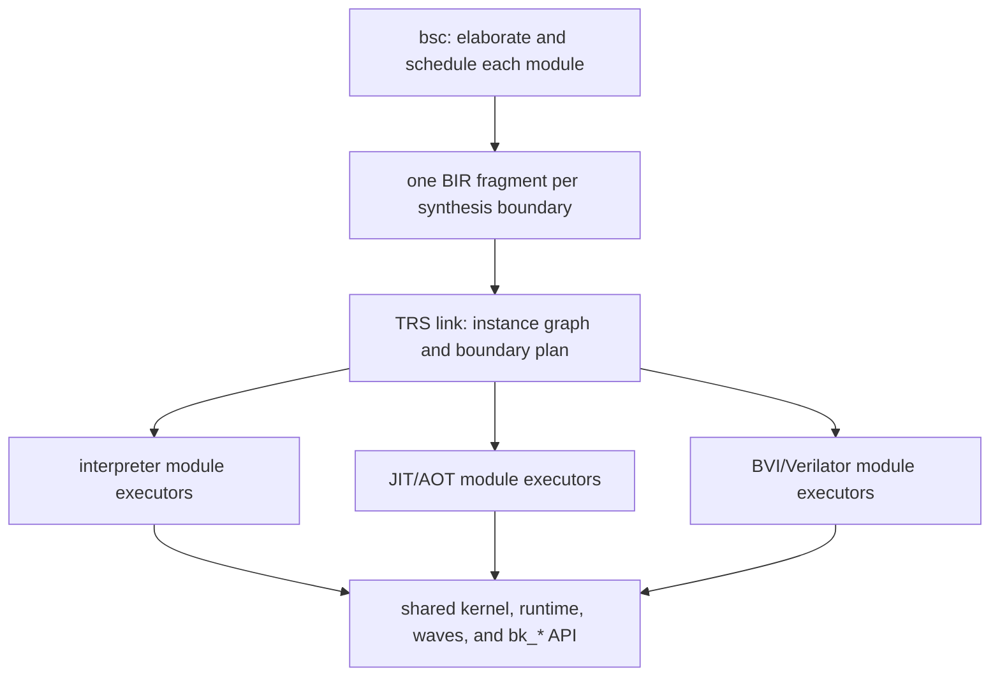

# TRS: a Rust/LLVM simulation backend for BSC

Status: normative architecture and migration plan.  The document began as
the "Bluesim 3" proposal (since renamed to "TRS"); historical source
references are retained where they explain the semantic contract, while §0
and the revised phasing govern the current hierarchy-first implementation.

## 0. Binding architecture rules

This section is normative.  It is an architecture reset after the first TRS
implementation demonstrated semantic coverage but allowed whole-design
planning and code generation to become the default.  When this section
conflicts with later historical prose, [BIR.md](BIR.md), a handoff document,
or the current implementation, this section wins until the other material is
updated.

1. **Correctness is non-negotiable.**  TRS must preserve BSC's scheduled TRS
   semantics and the observable Bluesim contract.  A scale or throughput win
   never excuses a semantic difference.
2. **Hierarchy is the canonical representation and execution model.**  A
   synthesized module is the unit of export, verification, interpretation,
   compilation, and reuse.  A design is an instance graph that binds those
   module artifacts.  No required path may first expand all rules, defs, or
   method bodies across all instances and then try to recover hierarchy.
3. **Scaling is an acceptance criterion, not a later optimization.**  For N
   identical instances, module-local analysis, interpreter preparation, LLVM
   lowering, optimization, and machine-code emission happen once per unique
   module specialization, not N times.  Link/runtime composition may grow
   with instances and their boundary surface; it must not grow with
   instances times module-internal rule or def count.
4. **The interpreter is the executable base.**  It is the first complete
   implementation of every semantic feature, runs the same hierarchical
   module artifacts as compiled engines, and remains a production-capable
   per-module or per-segment fallback.  JIT and AOT replace module executors;
   they do not replace the architecture.
5. **Dynamic scheduling is hierarchical.**  BSC records the guarded legal
   alternatives that require run-time selection.  TRS evaluates those guards
   before the affected edge and dynamically interleaves module-local schedule
   segments through boundary contracts.  TRS does not rerun BSC's scheduler,
   and dynamic scheduling is not permission to materialize a design-wide
   rule-expanded schedule.
6. **`import "BVI"` is a first-class boundary implementation.**  A BVI module
   participates through the same scheduling, clock, reset, method, and path
   contract as a synthesized BSV module, while its body is opaque and may be
   executed by a Verilator-backed module executor.  Verilation is a build
   step; running an artifact is load-only.  BDPI remains the foreign-function
   boundary, distinct from BVI module execution.
7. **Optimizations come after the hierarchical baseline passes.**  Inlining,
   fusion, whole-design specialization, and layout coalescing are optional
   transforms over the canonical hierarchy.  Crossing a synthesis boundary
   requires measured benefit, an explicit profitability rule, a bounded
   cache/invalidation cost, and a retained generic hierarchical path.  An
   optimizer may specialize a design; it may not make the specialized form
   the only executable form.
8. **Architecture exceptions are explicit.**  A change that violates one of
   these rules must identify the violated rule, publish the scale and runtime
   measurements that justify it, state the new bound, and receive design
   review before landing.  Passing the semantic corpus alone is insufficient.

The permanent scale gates are:

- repeated-instance ladders report constant module-local work per unique
  specialization and bounded growth of composition work;
- a leaf body edit leaves generic parent module artifacts unchanged when the
  boundary contract is unchanged;
- the default interpreter, JIT, and AOT paths contain no whole-design LLVM
  module and no instance-expanded copy of module-local executable IR;
- mixed interpreted/compiled/BVI designs pass the same semantic and ordering
  tests as single-engine designs; and
- diagnostics expose unique modules, instances, boundary segments, selected
  dynamic alternatives, per-module lowering count, emitted code bytes, and
  every cross-boundary specialization.

## 1. Goals

1. **Same semantics.**  Execute the schedule computed by bsc, including
   guarded dynamic alternatives, and implement TRS (one-rule-at-a-time)
   semantics exactly as today's Bluesim does, validated against the existing
   testsuite.
2. **Hierarchical scaling with design size.**  Module-local work scales with
   unique module specializations; design-level work scales with instance
   boundaries, not replicated internal rules.  This applies to the
   interpreter, JIT, AOT, debug metadata, and waveforms.
3. **Fast build turnaround.**  Code generation and linking must not be the
   bottleneck of the edit-compile-run loop.  Today the generated-C++ → g++
   path dominates link time for large designs; the replacement generates
   machine code directly through LLVM, in parallel by module, with
   content-addressed artifacts, and offers a JIT mode with no object files at
   all.
4. **Faster than Verilator.**  Single-thread throughput first; a credible path
   to multi-threading second.  Runtime throughput work follows the
   hierarchy/scaling gates rather than replacing them.
5. **Hierarchical execution and code generation.**  Per-module units that are
   reusable across instantiations and cacheable across links — extending the
   staged-codegen model of PR #2 (`-c` is point codegen, link is the closure)
   — instead of today's design-wide monolithic schedule file.
6. **Interpreter-first, mixed-engine execution.**  Any module may execute in
   the interpreter, JIT/AOT code, or a BVI adapter without changing the
   design's scheduling semantics.
7. **First-class BVI and BDPI compatibility.**  Run supported `import "BVI"`
   modules through a stable boundary contract and a build-time Verilator
   adapter; preserve the existing BDPI C ABI.
8. **First-class waveforms.**  VCD *and* FST output, carrying full module
   hierarchy/definition information, without the current "backing model"
   double-instantiation cost.
9. **Module-local state optimization.**  Registers and wires become plain struct
   fields / SSA values with direct loads and stores, not objects with method
   calls; only primitives with genuinely stateful protocols (FIFOs, BRAMs,
   synchronizers, clock generators) remain runtime calls.
10. **Drop-in compatibility.**  Keep the `bk_*` kernel C ABI and the
   `bluesim.tcl`/bluetcl driver working unchanged; keep BDPI, `$display`
   formatting, and plusargs.

Non-goals: the SystemC wrapper (dropped by decision 2026-07-08), 4-state
simulation (Bluesim is 2-state today), save/restore checkpointing (does
not exist today either), and general-purpose event-kernel co-simulation
outside the declared BVI boundary contract.

## 2. Where Bluesim stands today

A condensed map of the current implementation; this is what we must be
equivalent to, and what we are replacing.

### 2.1 Compile pipeline

The `.ba` file stores, per synthesized module, the **post-scheduling
`APackage`** (rules still rules) plus the **`AScheduleInfo`**
(`ABin.hs:37-93`).  Bluesim does *not* consume `ASPackage` — that flattened,
mux-based form is Verilog-only (`AState.hs:90-156`).

At link time (`bsc.hs::genModuleC`, driven from `simLink`):

- `SimExpand` reads the `.ba` hierarchy into one `SimPackage` per module
  (`SimPackage.hs:83-108`) and **merges every module's schedule into one
  global graph**, then splits it per clock domain and topologically flattens
  it into a single linear order of `Sched r`/`Exec r` nodes
  (`SimExpand.hs:720-868`, `314-378`).
- `SimMakeCBlocks` turns each `SimPackage` into a `SimCCBlock` (a C++ class
  model: state instances, defs, one function per rule/method) and each
  flattened per-domain order into a `SimCCSched` — the schedule function
  (`SimMakeCBlocks.hs:695-841`).
- `SimBlocksToC` prints C++: one `.h`/`.cxx` per module class, plus
  `schedule_<Top>.cxx` and `model_<Top>.{h,cxx}`; g++ compiles everything
  (optionally in parallel, `-parallel-sim-link`) and links a `.so` against
  `libbskernel.a`/`libbsprim.a`.  The "executable" is a shell script running
  `bluesim.tcl` against the `.so` (`bsc.hs::cxxLink`).

Per-module C++ is instantiation-independent ("reusable block" — see the PR #2
user-guide text), and object reuse exists (`SimFileUtils.hs`), but **the
schedule is a design-wide monolith**: it grows with the whole design, is
regenerated on any change, and is the worst compile unit for g++ (one huge
function full of cross-module member accesses).

### 2.2 Execution model (the TRS contract)

- Per (clock, edge) the kernel calls one generated **schedule function**
  whose body is, in order: (1) zero all rule `WILL_FIRE`s and method enables;
  (2) for each `Sched r` node, compute the defs feeding `CAN_FIRE_r`/
  `WILL_FIRE_r`; for each `Exec r` node, `if (WILL_FIRE_r) rule_r();`
  — in the flattened **earliness order**; (3) `clk()` ticks for primitives
  that need end-of-cycle bookkeeping; (4) a reset-tick block guarded by a
  global counter (`SimMakeCBlocks.hs:808-841`, `reset.cxx:1-43`).
- `WILL_FIRE_r = CAN_FIRE_r && !WILL_FIRE(more-urgent conflicting rules)` —
  the Esposito encoding (`AAddScheduleDefs.hs:28-84`; conflict pairs from
  `ASchedEsposito`, `ASyntax.hs:380-401`).
- Rules mutate state **in place**; registered semantics fall out of the
  schedule ordering reads before writes.  Because execution is destructive,
  Bluesim adds **ME inhibitors**: if rule r2 is disjoint with an earlier
  executed rule r1, `CF_r2 &&= !CF_r1` so r2 cannot observe r1's effects and
  fire when the TRS says at most one fires (`SimMakeCBlocks.hs:1636-1658`).
- Primitives that can be *read after being written* in the same instant keep
  a begin-of-cycle shadow guarded by a `bk_now()` timestamp: ConfigReg,
  RegTwo, CReg (port rotation at `clk()`), crossing regs, FIFO's
  `i_notEmpty/i_notFull`, RegFile write-forwarding (`bs_prim_mod_reg.h`,
  `bs_prim_mod_fifo.h:33-200`, `bs_prim_mod_regfile.h:364-410`).
- Intra-rule ordering of two method calls on one instance follows the
  submodule's `sSB` relation, captured as the `MethodOrderMap`
  (`SimExpand.hs:1842-1846`) and enforced by a topological sort of actions
  and defs inside each rule body (`tsortActionsAndDefs`,
  `SimMakeCBlocks.hs:1248-1533`).
- Rules with `clock_crossing_rule` run in a separate **after-edge** function
  (`ss_early_rules`; `run_combo_schedule_event`, `kernel.cxx:315`).

### 2.3 Kernel and runtime

A single binary-heap event queue ordered by `(time, packed priority)`;
priority packs `group << 28 | slot << 24 | clock#` — groups: INITIAL,
BEFORE_LOGIC, LOGIC, AFTER_LOGIC, FINAL; slots: RESET, UI, CYCLE_DUMP, VCD,
EXECUTE, … (`priority.cxx`, `event_queue.cxx`).  Clocks are `tClockInfo`
records with waveforms; derived/gated clocks are **aperiodic** clocks whose
edges are injected by generator primitives calling `bk_trigger_clock_edge`
from their `clk()` tick (`bs_prim_mod_clockgen.h`).  The simulation runs on
its own pthread; bluetcl drives it through the `bk_*` C API over a `dlopen`ed
`.so` (`bs_model.h`, `bluesim_kernel_api.h`, `BluesimLoader.hs`).

### 2.4 VCD

Change detection instantiates a **second complete copy of the model** (the
"backing instance") and walks the whole hierarchy every active timeslice
comparing live vs backing values (`SimBlocksToC.hs:512-546`,
`bs_prim_mod_reg.h:162`).  Signal IDs are sequential ints in base-94; times
are corrected so combinational signals appear to change after the *previous*
edge, via per-signal clock association and a pending-changes buffer keyed by
time (`vcd.cxx:15-34`, `387-462`).  No FST support.

### 2.5 What is slow today

Compile side:
- C++ is generated as *text*, then g++ re-parses it plus the template-heavy
  primitive headers per translation unit, at -O2, serially by default.
- The monolithic schedule file scales with the design and recompiles on any
  change; PR #2's reuse machinery explicitly cannot reuse it ("the top
  module, the schedule, and the model files are always generated by the link
  itself").

Run side:
- Every Reg/Wire/CReg is a C++ object; reads/writes are member calls into
  another object's storage.  Within one .o g++ inlines them, but rule code in
  module A calling methods of module B crosses translation units — no
  cross-module inlining without LTO (not used).
- The VCD backing model doubles memory and walks *all* signals per timeslice.
- Wide data is heap-ish (`WideData` with pooled allocation, word loops).
- Symbol tables, `Module` bookkeeping, and per-instance name strings are
  built eagerly for every instance at startup.

## 3. Architecture overview



The three executor kinds are interchangeable at a module boundary.  One
design may mix all three.  The link product contains the instance graph,
bindings, compact boundary-scheduling data, and references to reusable module
artifacts; it is not a copy of every module body per instance.

Split of responsibilities:

- **bsc keeps** evaluation, rule splitting, urgency/earliness computation,
  `CAN_FIRE`/`WILL_FIRE` insertion, conflict reasoning, and the proof of legal
  guarded dynamic-schedule alternatives.  Scheduler-internal analysis is not
  reconstructed downstream.
- **BIR export is per synthesis boundary.**  One `.ba` produces one module
  fragment without loading or copying child bodies.  The fragment carries
  the module-local executable IR, local schedule, boundary contract, and
  references to child module contracts.
- **trs link owns binding, not flattening.**  It follows fragment references,
  builds the instance graph, binds clocks/resets/methods/BDPI functions, and
  constructs the compact boundary plan used by the run-time scheduler.  It
  must not turn that graph into an instance-expanded collection of rule
  bodies, def cones, or LLVM functions.
- **module executors own bodies.**  The interpreter and LLVM engines implement
  the same BSV-module executor contract; the BVI adapter implements that
  contract for an opaque Verilog module.  The kernel and dynamic scheduler do
  not depend on which executor implements a module.

### 3.1 Why a new exchange format instead of reading `.ba`

`.ba` is a bespoke lazy Haskell binary encoding with structure sharing,
defined by `Bin` instances over bsc's internal types (`BinData.hs`,
`GenABin.hs`).  A Rust reader would be version-locked to bsc's internals and
break on every datatype change.  Instead, the TRS exporter emits **BIR**
(Bluesim IR): versioned CBOR containing only what simulation needs.  Note the
`.ba` already drops information Bluesim must recompute (e.g. `UseCond`s are
not round-tripped, `GenABin.hs:404-408`), so `.ba` was never a complete
interface either; BIR makes the actual contract explicit and testable.  The
full format is specified in [BIR.md](BIR.md).

The unit of export is one synthesized module, matching one `.ba`.  Exporting
that module must not read a child's executable body.  A fragment contains:

- the module boundary contract: method signatures and scheduling relations,
  clocks, resets, paths, parameters, and child contract references;
- instantiation-independent state layout, defs, rules, methods, local
  schedule segments, and guarded local alternatives already justified by
  bsc's scheduler;
- primitive and BDPI references; and
- for `import "BVI"`, an opaque BVI contract plus deterministic Verilator
  build inputs, never a synthesized BSV body.

At link, TRS follows the fragment closure and creates only design-specific
bindings: instance identities and state, clock/reset wiring, foreign-function
bindings, and boundary ordering/inhibit data.  Any representation of that
data must remain proportional to the instance graph and boundary surface.
It may not embed a copy of a module's internal rules or defs at every
instantiation.

Expressions and actions mirror `AExpr`/`AAction` (`ASyntax.hs:936-1148`)
after `simPackageOpt`: prim ops, constants, def/port/param refs, method
calls/values, foreign calls, task actions with cookies, gate refs.  The
format is a data contract, not an ABI: it is versioned, and `trs ir dump`
pretty-prints it for diff-testing against bsc's own dump flags.

## 4. Execution semantics in trs

Identical to today, restated as invariants every module executor and the
hierarchical scheduler must uphold:

1. Per (clock, edge), execute an order equivalent to bsc's legal earliness
   order: within a module, walk its local schedule segments; across
   boundaries, interleave segments according to the bound contracts.  For a
   guarded dynamic schedule, evaluate guards against pre-edge state and
   choose the recorded legal alternative before executing the affected
   edge.  Do not require a persistent rule-expanded global order.
2. `WILL_FIRE` per Esposito; ME inhibitors for disjoint rules executed
   earlier in the same edge (destructive-execution correctness patch).
3. Intra-rule action/def ordering per `MethodOrderMap` (`sSB`).
4. Begin-of-cycle shadows for the read-after-write primitives (ConfigReg,
   RegTwo, CReg ports, crossing regs, FIFO `i_*` methods, RegFile
   forwarding); everything else reads live state.
5. Primitive ticks after rules, producers before consumers
   (`sortTickCalls`, `SimMakeCBlocks.hs:646-680`); then the guarded
   reset-tick block.
6. Clock-crossing rules in the after-edge function at FINAL priority.
7. Event ordering by `(time, group, slot, clock#)` exactly as
   `priority.cxx` packs it — this is observable through `$display`
   interleaving across domains and must match.
8. Choosing interpreter, JIT/AOT, or BVI execution for a module is not
   semantically observable.  Boundary calls, observation frontiers, BVI
   commit points, and mixed-engine clocks/resets obey the same order.

These are encoded in a *semantics test kit* first (see §10): the hierarchical
interpreter is tested against today's Bluesim; compiled and BVI module
executors are tested against the interpreter and the relevant Verilog oracle.

## 5. Module execution and code generation

### 5.1 State layout: inline registers and wires

Each BSV module has an instantiation-independent state-layout descriptor.
Every executor receives an instance-relative state handle; generated module
code may not bake an instance path, a design-wide slot number, or a child's
absolute address into its generic body.  The instance allocator may pack
module state blocks into one arena for locality, but that packing is link
metadata, not part of module code identity.  A BVI instance carries an opaque
executor handle behind the same ownership boundary.

- `Reg`/`RegU`/`RegA`, `ConfigReg`, `RWire`/`Wire`/`PulseWire`, `BypassWire`,
  `CReg`, `Probe`, `Counter`, `RegTwo` are **not objects**: their storage is
  plain fields (`iN` for N ≤ 64, `[n x i32]`/`iN` beyond).  Reads are loads,
  writes are stores; the schedule order supplies register semantics.
  ConfigReg/RegTwo/CReg keep their small shadow fields with the same
  timestamp-free trick where possible: because the schedule is static, the
  codegen *knows* whether a same-cycle earlier write can reach a read and can
  materialize the shadow only when the schedule actually requires it — most
  ConfigRegs degrade to plain Regs after this analysis (today's runtime pays
  the `bk_is_same_time` check on every access, unconditionally).
- Wires zero their valid bits at edge start (fused with the existing
  enable-zeroing pass over a contiguous region — a few `memset`-like stores)
  or, when a wire's writer and readers are all in one domain segment and the
  liveness is local, the wire is **SSA-converted away** entirely.
- FIFOs, BRAMs, RegFiles, synchronizers, clock/reset generators remain
  runtime primitives in Rust (`trs-rt`), *monomorphized by codegen*: the
  generator emits calls to width-specialized `extern "C"` entry points
  (≤ 8/32/64-bit and wide variants), so no C++-template-style header cost and
  no dynamic dispatch.  Small FIFOs (depth ≤ 2, the overwhelmingly common
  `mkFIFO`/`mkPipelineFIFO` cases) get direct inline-IR expansions in a later
  optimization pass.
- Wide data (> 64 bits) uses LLVM's native arbitrary-width integers (`i128`,
  `i347`, …) for values and ops — LLVM legalizes them well — with `[n x i32]`
  storage in state structs for layout stability; no heap, no `WideData`
  objects, no `wop_*` out-parameters.

### 5.2 Hierarchical execution and code generation

The unit of executable work is the **module**, not the design.  This is true
before LLVM exists:

- A **module artifact** contains one boundary contract, one local state
  layout, local rules/methods/defs, and local schedule segments.  Preparing
  it for interpretation or lowering it to LLVM happens once per unique
  `(module content, parameter specialization, executor options)` key.
- An **instance record** contains only identity, a state handle, clock/reset
  bindings, child bindings, and boundary-scheduler state.  It references a
  shared module artifact and executor.  It never owns a copied rule body,
  def cone, optimized IR graph, or generated function.
- A **boundary plan** records only the ordering and inhibit facts that do not
  live inside one module.  The run-time scheduler uses it to interleave
  module-local segments.  Its size is bounded by instances times boundary
  surface; internal rule count is absent from the design-level unit.
- **Guarded alternatives** stay attached to the smallest boundary region
  whose ordering varies.  Their guards are evaluated against pre-edge state;
  the selected alternative drives that edge only.  The interpreter and
  compiled dispatch use the same representation.
- **Calls cross a stable module-executor ABI.**  A parent passes an instance
  handle and typed method arguments to the child's executor.  The generic
  parent artifact depends on the child's boundary contract, not its body.
  Consequently a child-body edit does not change the generic parent artifact.
- **LLVM is per module.**  Baseline JIT and AOT produce one LLVM module/object
  per module specialization plus small design-specific binding data.  There
  is no baseline whole-design LLVM module, mega-edge function, or later pass
  whose input already contains every instance's internal schedule.
- **BVI uses the same seam.**  A BVI executor is opaque module code with the
  declared schedule/path/clock/reset contract.  The boundary scheduler does
  not special-case a BVI parent or child beyond executor operations for
  observation and commit.

Segments should be cut at interface interaction points and any additional
points required to preserve scheduling semantics.  A module with many
internal rules and a small interface should therefore contribute a small,
bounded number of design-level scheduling units.  A highly coupled module
may expose more segments, but the representation degrades by exposing real
boundary interactions, never by eagerly copying all of its internal rules
into every instance.

Cross-module inlining, body fusion, and design-wide edge compilation are
**specialization passes**, disabled in the baseline.  A specialization is a
separate overlay keyed by the exact body closure it incorporates; it must be
reported by plan diagnostics and may be dropped without affecting the
generic artifact.  It cannot be used to claim that hierarchical compilation
works, and it cannot become the fallback for an unsupported feature.

### 5.3 Fire-condition and rule optimization

All standard LLVM scalar optimization applies within a module.  The
schedule-aware wins come from module-local passes over BIR before LLVM:

- **Dead-def pruning per cone**: only defs feeding a `WILL_FIRE`, an action
  argument/condition, or a wave-visible signal are materialized; others fold
  into rule bodies as SSA (today `SimCOpt.moveDefsOntoStack` approximates
  this; we do it by construction).
- **Disjointness short-circuits**: the `ExclusiveRulesDB` lets us emit
  `else`-chains instead of independent tests for mutually exclusive rules,
  and skip ME-inhibitor terms that LLVM cannot know are redundant.
- **Branch metadata**: `WILL_FIRE` tests get profile-informed or
  heuristic (`likely taken`) weights; rule bodies are laid out cold/hot.
- **Gate/reset hoisting**: gated-clock and in-reset tests hoist out of
  segment bodies.

### 5.4 System tasks and BDPI

`$display`-family keeps the current architecture (compiler-known format
string + parallel width-descriptor string, `dollar_display.cxx:169-350`) but
with a non-varargs ABI: codegen packs arguments into a stack array of
`(descriptor, value/pointer)` slots and calls Rust runtime formatting.  BDPI
imported C functions keep their exact current C ABI (including the
`Direct`/`Buffered` return styles and polymorphic `unsigned int*` marshaling,
`ForeignFunctions.hs:305-341`) so existing user C code links unchanged.

### 5.5 BVI module execution

An `import "BVI"` fragment carries a stable contract derived from `VModInfo`:
physical ports, typed parameters, methods and RDY/EN relationships, method
scheduling relations, clocks, resets, and declared combinational paths.
That contract is sufficient for a BSV parent to schedule against the module
without seeing its implementation.

The initial BVI executor uses Verilator behind a narrow C ABI.  Method calls
stage input/enable changes; value and ready reads are observation frontiers;
and one batched commit point applies non-clock inputs, coincident clock edges,
and enable clearing in the defined timeslice order.  Reset delivery, output
clocks, `$display`/`$finish`, plusargs, timing events, and fatal containment
are part of the executor contract and are tested in mixed hierarchies.

Verilation occurs only during an explicit build/link action and produces a
content-addressed per-module-specialization artifact.  A simulation run is
load-only and does not need Verilator or source files.  Unsupported BVI
surface is rejected at contract export or build with a precise diagnostic;
support is expanded by extending this executor, not by weakening hierarchy
or falling back to a whole-design Verilog translation.

## 6. Compile-time strategy

This is a first-class requirement, not a byproduct.

- **No C++ in the BSV-module loop.**  Module IR is constructed in memory and
  lowered by LLVM directly to objects.  We skip text generation, g++ parsing,
  template instantiation, and EH/RTTI bookkeeping for BSV modules.  A BVI
  executor may use Verilator/C++ in its separate content-addressed build step;
  it is not part of every TRS relink or run.
- **Parallel by module.**  One LLVM context/module per BSV module, codegen
  and object emission fanned across cores.  No whole-design LLVM context or
  mega-edge function may serialize the tail.
- **Content-addressed module artifacts.**  Identity includes module BIR,
  boundary ABI revision, parameter specialization, executor/codegen options,
  and TRS version.  `bsc -trs -c` exposes deterministic module outputs;
  `bsc -trs -e` binds them.  Bazel or another build system owns persistent
  caching in split builds; the direct one-shot flow may maintain a local
  project cache, but both consume the same artifact identity.
- **Link work stays link work.**  Instance-graph construction, binding,
  compact boundary planning, small dispatch metadata, and final packaging
  happen at link.  Module analysis, interpreter preparation, BVI verilation,
  and LLVM lowering do not move to link merely because the direct flow can do
  everything in one process.
- **Three BSV execution modes.**
  - **Interpreter (architectural baseline):** complete semantics, instant
    startup, mixed-mode fallback, and differential oracle.
  - **JIT:** ORC/LLJIT compilation per module or segment at -O0/-O1; hot
    module artifacts may be replaced by higher-tier implementations without
    changing bindings.
  - **AOT (default for `bsc -o`)**: emit objects, link the `.so` +
    runner; -O2/-O3 for long-running regressions.
- **BVI is orthogonal to the three modes.**  A BVI module selects its own
  opaque executor while BSV siblings may independently be interpreted, JITed,
  or AOT compiled.
- **Tiered effort knobs** surfaced as flags (`-sim-opt 0..3`), because "run
  a 10-second smoke test" and "run a 10-hour soak" deserve different
  compile budgets.

## 7. Runtime kernel (Rust)

A port of the current kernel's *semantics* with its accidental complexity
removed:

- Hierarchical edge scheduler: starts from an active clock-domain boundary,
  evaluates any guarded alternatives, and walks compact instance/segment
  bindings.  It dispatches module executors lazily and never constructs an
  instance-expanded copy of their internal schedules.
- Event queue: binary heap of `(time, packed priority)` exactly reproducing
  `priority.cxx` packing (observable ordering).  Handlers are enum variants,
  not fn pointers, so the hot path (clock edge → segment calls) is a direct
  match and call.
- Clocks: periodic waveforms and aperiodic derived clocks with
  `trigger_clock_edge` from generator primitives, `combinational_at`
  bookkeeping for wave time-correction, edge counters/limits for
  bluetcl `step`.
- Reset: global `reset_tick_requests` counter gating a per-edge reset block;
  async resets act immediately; generated resets defer to end-of-timeslice —
  as today (`reset.cxx`).
- Threading: the kernel itself is single-threaded and synchronous; the
  `bk_advance`/`bk_sync` async protocol is provided by an optional driver
  thread in the compat layer (bluetcl expects it), not baked into the core.
- The `bk_*` API is exported from a `cdylib` with the same symbol set the
  export maps allow today (`bs_elf_export_map.txt`), so `BluesimLoader.hs`
  and `bluesim.tcl` work unmodified.  Additionally a **native runner** binary
  links the same core so `./sim` runs without tcl (plusargs, `-V vcd`,
  `--fst`, `-m cycles` style flags) — removing tcl startup from CI hot paths.

## 8. Waveforms: VCD and FST

One `wave` subsystem with two writers behind a trait; both fed by the same
change-capture machinery.

- **Change capture without a backing model.**  The module-executor contract
  exposes wave-visible changes: the interpreter records semantic writes,
  compiled modules emit compare-and-append operations at commit points, and
  BVI executors sample declared observable outputs at their batched commit.
  All feed a per-domain **change buffer** (instance, signal id, new value),
  with no second model and no full-hierarchy walk per timeslice.  Wave-disabled
  executors pay zero; enabling waves may select or JIT a wave-instrumented
  module variant without changing the boundary plan.
- **Time correction** (combinational values appearing after the previous
  edge) is kept: each signal carries its driving-clock association; the
  buffered changes flush once a timeslice's `combinational_at` frontier
  passes, as `vcd.cxx:387-462` does today.
- **VCD writer**: base-94 ids, `$scope module` hierarchy, same output shape
  as today (byte-compatibility where feasible makes diff-based migration
  testing possible).
- **FST writer**: via the pure-Rust `fst-writer` crate (validated to build
  in-tree), giving compressed, seekable waves.  Hierarchy carries **module
  definition information**: FST scopes support `(scope type, instance name,
  definition name)`, so every instance scope records its BSV module name
  (from `InstModMap`), and signals carry width/type plus rule
  `CAN_FIRE`/`WILL_FIRE` when `-keep-fires` is on.  VCD approximates the
  same with `$comment` metadata per scope.
- Symbol/introspection tables (for bluetcl `sim lookup/get`) are generated as
  static data (sorted, shared per module type), not per-instance heap
  constructions.

## 9. Performance versus Verilator: why this can win

Structural advantages we inherit from Bluespec + TRS:

- **The schedule is computed once, by the compiler.**  Verilator evaluates a
  levelized combinational netlist and re-evaluates fanout cones; Bluesim
  executes ~one branch + one body per rule per cycle, and dead rules cost a
  single well-predicted branch.  There is no convergence loop, no eval/trigger
  bookkeeping.
- **Coarse grain.**  Rules are much bigger than gates; the work per branch
  decision is larger, and the state accesses within a rule body are
  register-allocatable SSA after inlining.
- **Two-state, word-packed** — same as Verilator; no penalty there.
- **Less materialized state.**  Verilog-visible intermediate wires don't
  exist unless waves need them; Verilator must keep everything its scheduler
  or taps touch.

What we must do well to actually win (and how):

- **Cheap module boundaries** — stable direct-call/trampoline paths, compact
  instance handles, typed argument slots, and batched boundary transitions.
  Boundary cost is measured before cross-module inlining is considered.
- **Memory locality without code coupling** — instance state blocks may be
  arena-packed and hot/cold split, but module executors use relative layout
  and remain reusable across designs and instance positions.
- **No per-access overhead** — no `bk_is_same_time` timestamp checks on the
  common path (statically resolved, §5.1), no virtual calls, no symbol/name
  machinery in the hot path.
- **Wave capture that doesn't tax non-wave runs** (§8) — today VCD-capable is
  always paid for (backing model allocated when dumping starts, dump walk per
  slice).
- **Scaling**: compilation and executable IR are per unique module
  specialization.  The instance graph and boundary scheduler are also the
  substrate for later **partitioned parallel execution**: per clock domain
  first, then conflict-free boundary regions with private commit buffers.
  Parallelism is explicitly phase 6; it does not justify flattening earlier.
- **Selective specialization, only when measured** — after the generic path
  is competitive and passes scale gates, a hot boundary may be fused or
  inlined under the rules in §0 and §5.2.  Benchmark reports include both the
  speedup and the added build time, code bytes, memory, and invalidation fanout.

Benchmark plan: the testsuite's larger designs, repeated-instance ladders,
and external cores that already build with bsc (Piccolo/Flute-class RISC-V
SoCs, Ethernet/DMA-style designs).  Measure cycles/sec, link-to-first-cycle,
edit-relink-rerun latency, peak build/run memory, executable/IR bytes, and
the slope of each metric as identical instances are added.  Compare against
current Bluesim and Verilator (`--threads 1` and best-N) on the same RTL.

## 10. Phasing

- **P0 — Freeze contracts and expose scale counters.**  Bring DESIGN.md,
  BIR.md, and the boundary/BVI contracts into agreement; add plan diagnostics
  and repeated-instance/leaf-edit gates.  Keep the existing whole-design
  engine only as a differential reference.  Deliverable: the current engine
  has measured scale curves and every forbidden whole-design structure has
  an identified replacement seam.
- **P1 — Hierarchical interpreter and dynamic boundary scheduler.**  Load one
  fragment per module, share prepared module artifacts, allocate per-instance
  state, and execute local segments through compact boundary bindings.
  Guarded alternatives select per-edge interleavings.  Deliverable: static
  and dynamic-schedule suites pass against Bluesim, while repeated-instance
  module-local work stays constant.
- **P2 — Complete interpreter surface and mixed BVI.**  MCD, derived/gated
  clocks, resets, crossing rules, primitives, BDPI, system tasks, interactive
  API, waveforms, and the Verilator-backed BVI executor all run through the
  same hierarchy.  Deliverable: full semantic corpus plus BVI/Verilog oracle
  tests, including interpreted BSV above and below BVI boundaries.
- **P3 — Per-module LLVM executors.**  Implement JIT and AOT for the module
  executor ABI, with deterministic `-c` artifacts and small `-e` binding.
  Unsupported operations fall back at module/segment granularity to P1,
  never to a monolithic design compiler.  Deliverable: mixed interpreter/JIT/
  AOT/BVI parity and constant lowering/emission count across instance ladders.
- **P4 — Make hierarchy the only default architecture.**  Switch the product
  default after P1-P3 gates hold, quarantine then remove the whole-design
  planner/lowerer, mega-edge path, and instance-derived code identities.
  Deliverable: no default code path can construct them.
- **P5 — Measured performance program.**  Module-local SSA/layout work,
  branch metadata, small-primitive lowering, wave tuning, and then explicit
  boundary specializations where total-cost benchmarks justify them.
- **P6 — Parallel execution.**  (The SystemC wrapper was dropped from
  scope: trs will not provide one.)

No phase may land a flat production baseline with a promise to recover
hierarchy in a later phase.  Temporary experiments that violate §0 stay
behind non-default developer flags and cannot become dependencies of later
work.

## 11. Risks and mitigations

- **Semantics drift** (ME inhibitors, timestamp shadows, `$display`
  ordering, event tie-breaking): mitigated by the interpreter-first plan and
  bit-identical stdout/VCD differential testing.  The hierarchical scheduler
  must demonstrate equivalence to the legal bsc order, including guarded
  alternatives; it does not invent ordering policy.
- **Architecture regression hidden by parity**: a monolithic implementation
  can be semantically perfect and still violate the product requirement.
  Scale counters and repeated-instance/leaf-edit tests are required CI gates,
  reviewed alongside parity.
- **Boundary under-specification**: a child body, BVI model, or dynamic
  alternative may depend on information absent from its contract.  Decode
  verification, mixed-engine differential tests, BVI observation checks, and
  fail-closed unsupported diagnostics prevent silent substitution.
- **Module ABI churn**: the executor ABI and state-layout contract carry
  explicit revisions in artifact identities; mismatches fail before run and
  never fall back to body inlining.
- **BIR schema churn**: versioned schema, decode-time validation, and paired
  exporter/loader tests make datatype changes break the build rather than the
  wire format silently.
- **LLVM API churn / packaging**: pin via `inkwell`/`llvm-sys` (LLVM 18
  validated in-tree; llvm-sys tracks LLVM 8-22); prerequisites are
  `llvm-18-dev` + `libzstd-dev`; JIT-only mode needs no system linker.
  Fallback codegen via textual `.ll` emission is kept behind a feature for
  debugging.  **JIT specifically**: inkwell's safe `ExecutionEngine` wraps
  the legacy MCJIT API, which is under an upstream removal plan — the
  production JIT is ORC LLJIT via `llvm_sys::orc2` behind a thin wrapper
  of our own (the raw C API is marked experimental; the unsafe surface is
  confined to one module).
- **Verilator variability for BVI**: pin and capability-check the supported
  Verilator range, derive model metadata from stable generated build products,
  include tool/source/parameter identities in build keys, and test load-only
  artifacts across supported versions.
- **`$display` fidelity**: the format engine is ported with its tests; the
  descriptor-string contract is preserved.
- **fst-writer maturity**: it is young; we keep the writer behind a trait,
  validate against GTKWave/Surfer readers in CI, and can swap to C `fstapi`
  bindings without touching capture code.

## 12. Repository layout

```
src/trs/               Rust workspace (this directory)
  DESIGN.md                 this document
  crates/
    trs-ir/               BIR schema, loader, verifier, pretty-printer
    trs-kernel/           event queue, priorities, clocks, resets, bk_* core
    trs-rt/               primitives (FIFO, RegFile, BRAM, sync*), system
                            tasks, plusargs, wide-data helpers
    trs-wave/             change capture, VCD writer, FST writer
    trs-codegen/          LLVM lowering (feature "llvm", needs llvm-18-dev)
    trs-vlt/              BVI contract adapter and Verilator build products
    trs/                  CLI: link planner, JIT/AOT driver, native runner
  trs-bir/                one-.ba-to-one-BIR-fragment exporter
```

`cargo build` in `src/trs` builds everything except `trs-codegen`
unless `--features llvm` is given, so the workspace compiles on machines
without LLVM dev packages.

## Appendix A: decision record — LLVM codegen in Rust, not in bsc

Considered: (A) Haskell + LLVM FFI bindings inside bsc; (B) bsc emits
textual `.ll` and shells out to clang/llc; (C) BIR export + Rust codegen
(chosen).  Summary of the investigation (mid-2026):

- **(A) has no viable substrate.**  llvm-hs's last release is 9.0.1 (2019,
  LLVM 9), incompatible with GHC ≥ 9.0; no branch past LLVM 15 (unreleased,
  last commit 2023); forks top out at LLVM 12.  The one maintained binding,
  llvm-ffi (LLVM 13-21), has no ORC/LLJIT — only the legacy
  ExecutionEngine, which upstream is removing.  So (A) means hand-rolled
  LLVM-C FFI inside bsc and linking libLLVM into a plain make+ghc build
  across the 10-target CI matrix.
- **(B) is workable but loses what matters here.**  It forfeits the
  in-process JIT (lazy per-segment compilation, tiering, `$dumpvars`
  re-lowering — §6, §8); its flagship precedent, GHC's `-fllvm`, documents
  a perpetually moving supported-LLVM window, slow compiles, and
  miscompile-class textual-IR bugs still being fixed in 2025 — nothing
  type-checks emitted text.
- **The codegen↔runtime contract decides it.**  Today's backend hardcodes
  ~92 runtime-facing strings in four Haskell files (250+ distinct
  agreements: the 84-entry primitive map, `METH_*`, `wop_*`,
  `rst_tick__clk__1`-style mangles, `vcd_*`, `bk_*`), kept honest *only*
  because g++ type-checks generated C++ against the real runtime headers
  every build.  Any LLVM-emitting design loses that check; under (A)/(B)
  the contract survives as unchecked strings **and** grows a reverse
  channel (Haskell would need Rust-side struct sizes/alignments for flat
  state, wave buffers, symbol tables).  Under (C) the whole surface
  becomes rustc-checked shared types in one workspace, and the planned
  optimization work — which churns exactly this seam — stays one-language.
  The cross-language boundary lands instead at the post-scheduling IR, the
  most stable point in the pipeline.
- **Precedent**: every modern fast RTL simulator surveyed (arcilator,
  ksim, ESSENT, GSIM — the latter ~20x single-thread Verilator on
  Rocket/CoreMark) is a standalone systems-language tool consuming a
  post-elaboration simulation IR exported by the frontend; CIRCT tried
  direct HW→LLVM lowering and abandoned it for a mid-level IR (Arc ≈ BIR).
- **What the Haskell option got right** was folded back into the design:
  each `.ba` exports an already-scheduled module fragment, including local
  rule/method order and any scheduler-proved guarded alternatives (§3.1).
  TRS binds and executes those facts through the hierarchical boundary plan;
  it does not re-run the compiler's conflict/SAT reasoning or flatten the
  executable bodies across instances.

Revisit if: the JIT loop is dropped as a requirement *and* sustaining
maintainers are Haskell-only (then (B) against the existing C++ runtime is
the fallback); or a maintained Haskell LLJIT binding materializes.
